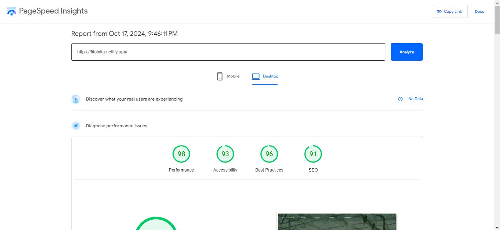

# Teknovistafest 2024 - Fita Loka

Project ini dikembangkan sebagai bagian dari kompetisi TeknovistaFest 2024. Website berbasis React ini dirancang untuk memperkenalkan teknologi dan memberikan solusi inovatif agrikultural modern.

## Deskripsi Proyek

Proyek ini adalah sebuah website design yang dirancang untuk mengambangkan teknologi modern untuk mangatasi masalah pertanian. Website ini dibangun menggunakan HTML, Tailwind CSS, dan React Vite JS.

## Fitur Utama
- Responsive Design: Desain yang dapat beradaptasi dengan berbagai ukuran layar.
- Navigasi Interaktif: Navigasi yang mudah digunakan dengan menu yang responsif.
- Animasi & Interaksi: Menggunakan animasi untuk meningkatkan pengalaman pengguna.

## Cara Kerja Web Design

### Struktur Desain:

- Header: Bagian atas halaman dengan logo, navigasi, dan menu.
- Main Section: Bagian utama yang berisi konten inti, seperti produk, layanan, atau informasi utama.
- Footer: Informasi kontak, link penting, dan media sosial.
Navigasi: Pengguna dapat menavigasi situs web melalui menu navigasi di bagian atas halaman. Setiap link di dalam menu akan mengarahkan pengguna ke halaman atau bagian yang relevan di dalam website.

### Animasi

Website ini menggunakan CSS transitions dan AOS untuk memberikan efek animasi pada beberapa elemen seperti tombol, gambar, dan scroll.

## Installation

- Node.js - [Unduh Node.js di sini](https://nodejs.org/en)

- npm - Npm termasuk dalam Node.js, atau dengan:

```bash
npm install
```

## Cara Menjalankan Project

- Clone repository ke lokal komputer Anda:

```bash
git clone https://github.com/NiceTeamDiam/teknovest-nice_team.git
```

- Masuk ke dalam direktori project dengan perintah:

```bash
cd teknovest-nice_team
```

- Instal semua dependencies yang diperlukan:

```bash
npm install
```

- Setelah dependencies terinstal, jalankan server development dengan Vite menggunakan perintah:

```bash
npm run dev
```

- Untuk membuat versi produksi dari project ini, gunakan perintah berikut (opsional):

```bash
npm run build
```

## Link Hosting

Kami menggunakan domain `netlify.app`

Fito Loka - [fitoloka.netlify.app](https://fitoloka.netlify.app/)

## Tangkapan Lighthouse dari kami


